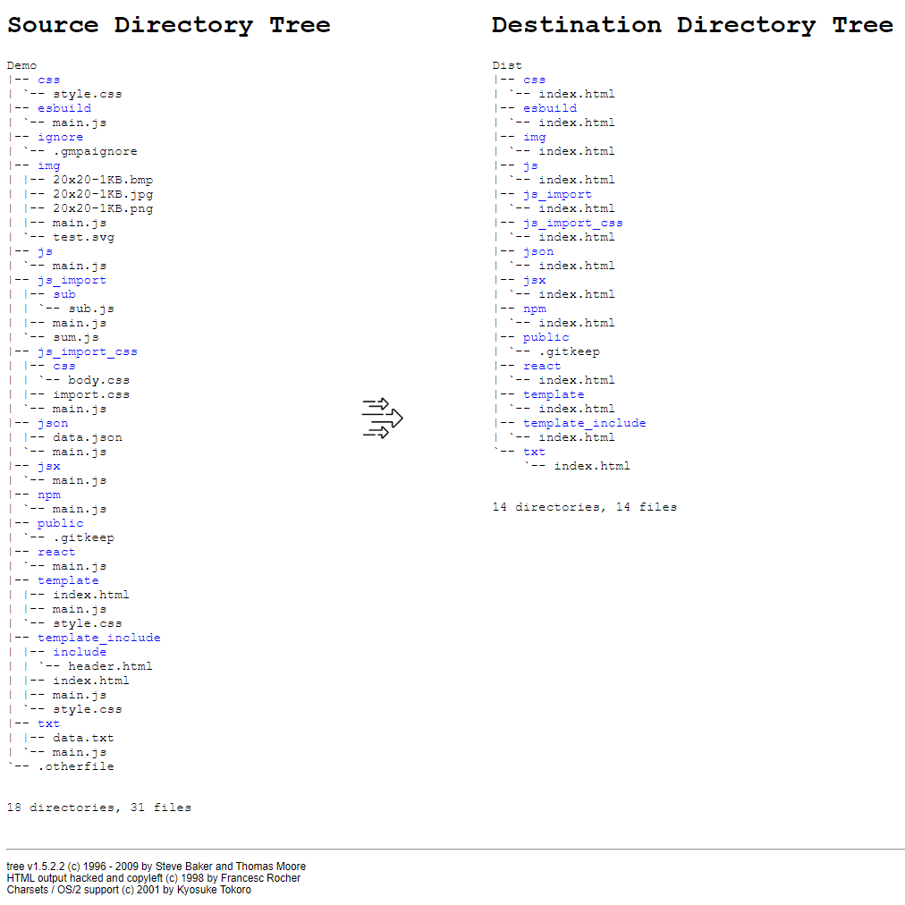

# gmpa

The cli tools for build Multi-Page Application.

# use

```go
go install github.com/gozeon/gmpa

cd <target folder>

gmpa build

# or

gmpa build --target ./demo --output ./demo/dist
```

see `demo` .

# screenshot



# reference

- https://github.com/evanw/esbuild
- https://github.com/otiai10/copy
- https://github.com/sirupsen/logrus
- https://github.com/spf13/afero
- https://github.com/spf13/cobra
- https://github.com/hyrious/esbuild-plugin-style
